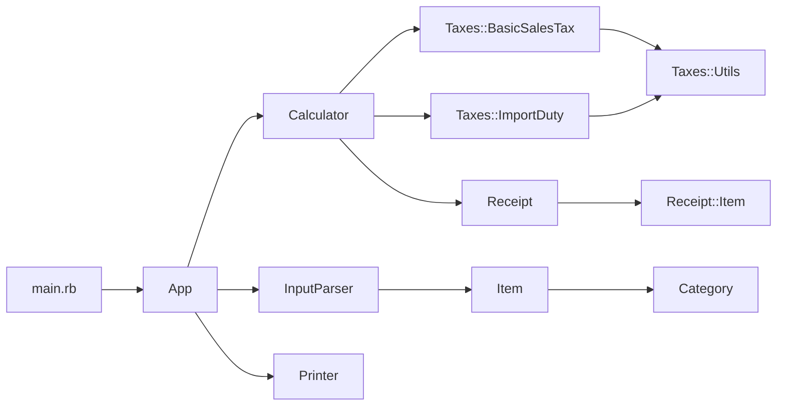

## How to run the solution

The entry point is `main.rb`, which accepts a path to a file with an input. All provided input files are located in the `input` folder. So to run example input you should run in the console:

```bash
ruby main.rb input/1.txt
```

The result will be printed to stdout.

## Assumptions made

I assumed the input categorization based on the input provided. So the rules I made are the following:
 - the `book` category is any item with "book" word in the name
 - the `food` category is any item with "chocolate" word in the name
 - the `medical` category is any item with "pill" word in the name
 - `imported` goods have "imported" word in the name

I assumed that input consists of newline separated lines with the structure of "{quantity} {name} at {price}". Any other input will fail with an exception.

## Solution Class Diagram

Here is a diagram showing the class calls to help understand the code.


