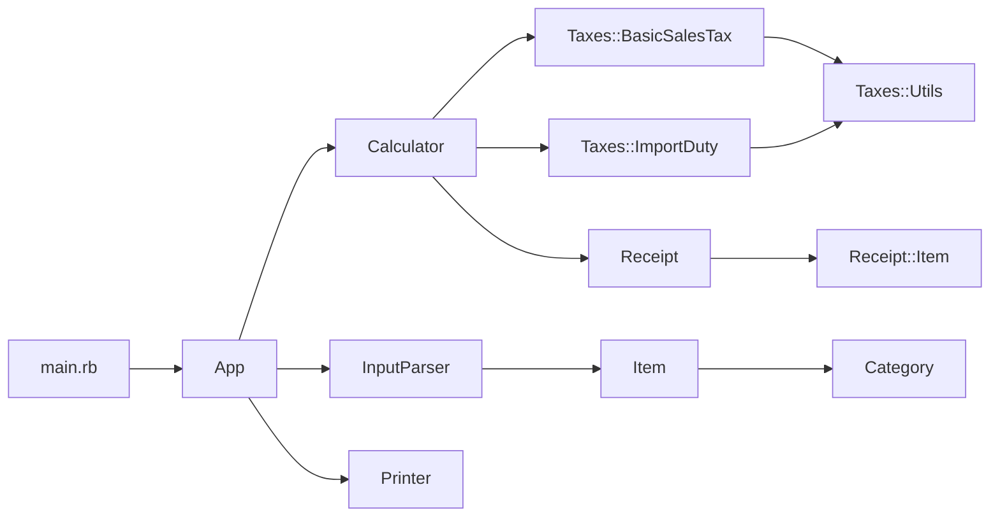

## Solution classes diagram

```mermaid
  flowchart LR
    App --> Calculator
    App --> InputParser
    InputParser --> Item
    Item --> Category
    Calculator --> Taxes::BasicSalesTax
    Calculator --> Taxes::ImportDuty
    Taxes::BasicSalesTax --> Taxes::Utils
    Taxes::ImportDuty --> Taxes::Utils
    Calculator --> Receipt
    Receipt --> Receipt::Item
    App --> Printer
    main.rb --> App
```
